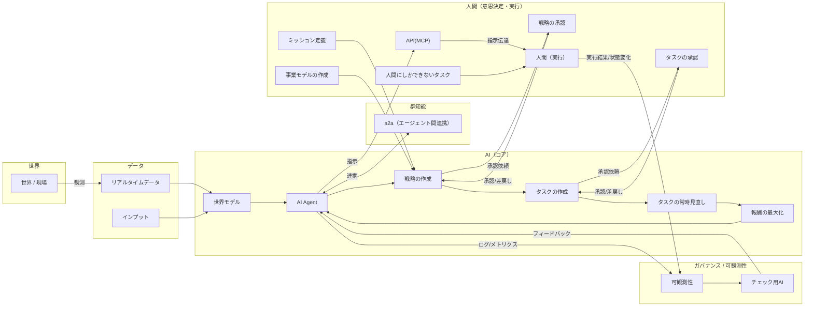
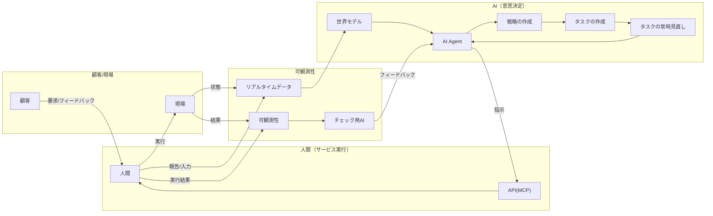

# AI Driven Autonomous Company（事業プラン）

## スライド1
# AI Driven Autonomous Company
AI駆動自律型企業に向けて

---

## スライド2（背景）
- AIの技術的進化
- ホワイトワーカーのタスクの変化
- **ポジショニング**
  - インターネット登場時のAmazonのような立ち位置
  - 新しいインフラ（AI）上での勝者を目指す

---

## スライド3（MVV）
- **ミッション**
  - AI自律企業（Autonomous Enterprise）を社会の標準インフラとする
- **ビジョン**
  - 「学習・自律・飛躍」のサイクルで自己進化し続ける無限成長企業体（Infinitely Growing Enterprise）を実現する
- **コアバリュー**
  - **AI Native Rebuild**: 既存プロセスの改善（DX）ではなく、AIネイティブなゼロベース設計
  - **Autonomous by Design**: 人間の介在を「例外処理」と定義し、設計から最小限に抑える
  - **Exponential Velocity**: 意思決定の集中と高速化による圧倒的な競争優位とスピード

---

## スライド4（モチベーション）
- 企業の事業活動のみならず、企業の形態そのものをAIを前提にしてゼロベースで見直す
- 「既存の業務をAIで自動化する」ではなく、「AI時代だからこそ実現できる企業の形」をデザインする

---

## スライド4（基本アーキテクチャ）
- コアはAI Agent
- 学習期：人間との伴走
- 自律期：人間の承認
- 飛躍期：自己学習による事業活動の最大化と最適化

---

## スライド5（柔軟に問題を対応できるように）
- AIが人間の行動に指示だすためのAPI(MCP)を作成する
  - （人間は指示通り動かないので状態変化、例外処理が必須）

### 図：自律分散型企業アーキテクチャ（推定）

---

## スライド6（サービス業について）

### 図：サービス業（対人/現場）での運用イメージ（推定）

---

## スライド7
（テキスト抽出なし）

---

## スライド8（AIに関する認識）
- Not AIはツールにしかすぎない
- 産業革命以上のインフラ
- Not AIは人間よりも進化しない
  - 知性・知能の形は違えど様々な知識で人間を超える（人間がゴールを動かしている）
- ※人々が予想するよりも進化が早い
- AI Agentが人間をフィードバックループに組み込む能力
- AIが人に対してABテストを実施
- パーソナリティや趣味嗜好を分析して、世界モデルの改良
- 自己最適化AI

---

## スライド9（提供サービス）
AIエンジニアリング x 事業コンサル

---

## スライド10（提供サービス）
- 開発組織の再構築コンサルティング
- IT業界全体
- ディストラクティブ
- エンジニア（コミュニティ活動の発展系に）

---

## スライド11（なぜ新会社なのか？）
- CLの中での制約
- アジャイル vs ポストアジャイル
- Sherpaを前提としない（開発者ゼロへ）
- フルコミットできない
- COSTAへの投資が必要
- ゼロベースでのチャレンジ
- 全てをAI前提で作り直す
- AIの進化を前提にふりきることが重要（投機的リスク）
- 意思決定の集中（意思決定の速さと方針変更の高速化）
- モチベーション
