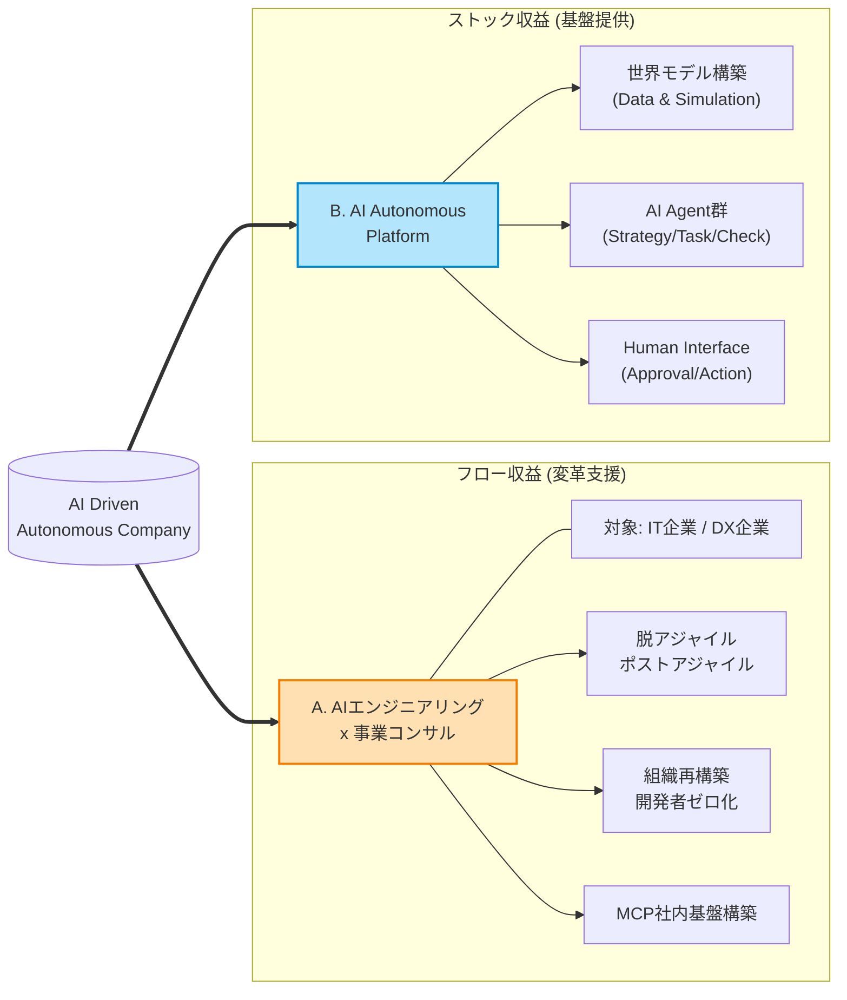

# AI Driven Autonomous Company 事業計画詳細

## 1. エグゼクティブサマリ
本事業は、既存の「人間中心の事業活動をAIで効率化する」というアプローチではなく、「AIが主体となり、人間がその自律を支援する」という完全なパラダイムシフトを前提とした新しい企業形態と事業モデル（AI Driven Autonomous Company）への変革を起こすための事業である。
AI Driven Autonomous Companyでは、企業活動の中心に「AIエージェント」を据え、意思決定からタスク実行までを自動かつ自律化させる。この中で人は「ミッション定義」「スキーム定義」「レビューと承認」「物理的実行」「監査」を行う。
ビジネスモデルとしては、このアーキテクチャを自社で実証し、導入コンサルティングおよびビジネスのフレームワークとしてプラットフォーム化と外部提供を行う。

---

## 2. 事業ミッション & ビジョン
- **ミッション**: AI駆動企業「AI Driven Autonomous Company」を、社会の標準インフラとする
- **ビジョン**: AIの進化を見越して、社会・人類の未来を創る
- **コアバリュー**:
  - **Zero-Base Design**: 既存プロセスの改善（DX）ではなく、AIネイティブなゼロベース設計
  - **Autopilot**: 人間の介在を「例外処理」と定義し、設計から最小限に抑える
  - **Believe the Scaling**: AIの進化則（Scaling Law）を前提とし、人間の制約を超えた指数関数的な成長を追求する

---
## 3.AI駆動企業「AI Driven Autonomous Company」とは？

AI Driven Autonomous Companyは、従来の「人間中心の業務フロー」をAIが完全に代替し、人間がその自律を支援する新しい企業形態である。このモデルでは、AIエージェントが意思決定からタスク実行までを自律的に担い、人間はミッション定義、スキーム定義、レビューと承認、物理的実行、監査の5つの役割を果たす。

この企業形態の特徴は以下の通りである：
- **自律性**: AIエージェントが業務の大部分を自律的に処理
- **人間の役割の再定義**: 人間は創造性、判断力、責任、現場対応に集中
- **透明性と監査性**: すべての意思決定プロセスが記録・監査可能

## 3. マーケット分析とターゲット
### 市場環境
- **ポジショニング**: インターネット黎明期におけるAmazonのように、AI黎明期において「AIネイティブな企業形態」を最初に定義し、プラットフォーマーとしての地位を確立する。
- **AIの進化**: 産業革命以上のインフラ変革期。「AIは単なるツール」と捉える企業と、「AIを主体」と捉える企業の格差が拡大する。
- **労働市場**: ホワイトワーカーのタスクがAIに代替され、人間は「責任（承認）」と「身体性（現場）」にシフトする。

### ターゲットセグメント
1.  **Phase 1（導入期）: IT・ソフトウェア業界**
    - 開発プロセス自体がデジタル完結しており、AIによる代替・自動化が最も容易。
    - エンジニア不足に悩む企業に対し、「エンジニアを増やす」のではなく「AIで代替する」ソリューションを提供。
2.  **Phase 2（展開期）: サービス業・オペレーション集約型産業**
    - コールセンター、物流管理、店舗運営など。
    - AIが「店長/管理者」となり、現場スタッフ（人間）に具体的タスクを指示するモデル。

---

## 4. 提供サービス概要

主な収益源は以下の2軸となる。

### A. AIエンジニアリング × 事業コンサルティング（フロー収益）
「開発組織の再構築」を主軸としたハイエンドコンサルティング。（イメージ：フューチャーアーキテクトのAIエンジニア版）
- **対象**: レガシーな開発体制を持つ大手IT企業、DX推進企業
- **内容**:
  - 既存の「アジャイル開発」からの脱却支援（ポストアジャイル）
  - AI Agent活用を前提とした組織設計（開発者ゼロ化へのロードマップ策定）
  - MCP (Model Context Protocol) を用いた社内API基盤の構築
- **単価イメージ**:
  - 戦略策定フェーズ: 500万〜1,000万 / 3ヶ月
  - 実装・伴走フェーズ: 300万〜 / 月

### B. AI Autonomous Platform 提供（ストック収益）
自律型組織を運用するための基盤システムのライセンス/利用料。（イメージ：AWSのAIエージェント版）
- **機能**:
  - **世界モデル構築**: リアルタイムデータ収集とシミュレーション
  - **AI Agent群**: 戦略立案、タスク生成、検証（Check AI）の自動化
  - **Human Interface**: 人間へのタスク指示・承認・フィードバックループ管理
- **モデル**: SaaS型 または レベニューシェアモデル（成果報酬）

---

## 5. 差別化要因 (Competitive Advantages)

既存のDXコンサルティングやAI開発会社と比較し、本事業は「AIの役割」と「組織の定義」において根本的に異なるアプローチをとる。

### 1. "Copilot" ではなく "Autopilot" (主従の逆転)
- **他社 (Copilot型)**:
  - 人間が主、AIは副。
  - 「人間の業務をAIがいかにサポートするか」に主眼を置く。
  - 最終的なボトルネックは常に「人間」に残る。
- **当社 (Autopilot型)**:
  - AIが主、人間は副（Reviewer/Physical Actor）。
  - AIが自律的に事業を回し、人間はAIができない物理的行動や法的責任の承認のみを行う。
  - 人間の処理能力に依存しないスケーラビリティ（Exponential Growth）を実現する。

### 2. "DX (Digital Transformation)" ではなく "AX (AI Transformation)"
- **他社 (改善)**:
  - 既存の業務フロー（AS-IS）を前提に、部分的にAIを導入して効率化する。
  - 既存組織のしがらみや、人間にとっての「やりやすさ」が優先される。
- **当社 (再構築)**:
  - AIが実行・管理しやすい形式に、業務プロセス自体をゼロベースで再設計（Rebuild）する。
  - 人間にとっては不自然なフローであっても、AIにとって最適であれば採用する（AI Native）。

### 3. "Agile" ではなく "Autonomous"
- **他社 (開発プロセス)**:
  - 人間同士のコラボレーション（スクラム、定例会議、ドキュメント）を最適化する。
- **当社 (自律生成)**:
  - AI Agent間の高速なインタラクション（Swarm）により、会議や調整コストをゼロにする。
  - 人間は「承認ゲート」としてのみ機能し、プロセスの中に入り込まない。

### 4. 自社自身が最大の「実験体」であること
- 理論上のフレームワークを提供するだけでなく、自社自身が「AI Driven Autonomous Company」として運営される。
- 開発者ゼロ、管理者ゼロでの企業運営という極端なドッグフーディングから得られる、生々しい失敗と成功のナレッジ自体が最強のコンテンツとなる。

---

## 6. 展開戦略（ロードマップ）

### フェーズ1：実証実験とプロトタイプ（Year 1）
*自社を実験台とした「完全自律型企業」の構築*
- **目標**: 自社のバックオフィスおよび開発業務の90%をAI Agent化
- **アクション**:
  - AI Agentコアエンジンの開発
  - MCPによる各SaaS/ツールの統合
  - 「学習期」の実践：人間がAIに伴走し、フィードバックデータを蓄積

### フェーズ2：コンサルティング展開と実績作り（Year 2）
*IT業界向け「開発組織再構築」サービスの提供*
- **目標**: 導入社数 5〜10社、モデルケースの確立
- **アクション**:
  - 「開発者ゼロ」を目指すパイロットプロジェクトの実施
  - 提携パートナーとの事例創出
  - コンサルティング部隊の組成（少数精鋭）

### フェーズ3：プラットフォーム化と他業種展開（Year 3〜）
*サービス業への展開とSaaS提供*
- **目標**: 自律型経営プラットフォームの外部販売開始
- **アクション**:
  - 汎用的な「AI経営者モジュール」のAPI化
  - サービス業（飲食、小売）向けパッケージの開発
  - 「飛躍期」への突入：AIが自ら事業モデルを修正し、拡大再生産するフェーズへ

---

## 7. 売上シミュレーション（概算）

| 年度 | フェーズ | 主な収益源 | 売上目標（年商） | 営業利益率 | 備考 |
| :--- | :--- | :--- | :--- | :--- | :--- |
| **Year 1** | 準備期間 | 受託開発・アドバイザリー | 1,000万円 | - | プロダクト開発投資を優先 |
| **Year 2** | コンサル展開 | 戦略コンサル・PMO | 2,500万円 | 20% | コンサル単価の向上 |
| **Year 3** | プラットフォーム | ライセンス利用料・RS | 3,750万円 | 30% | ストック収益比率の増加 (YoY +50%) |
| **Year 5** | スケール | 全産業向け展開 | 8,400万円 | 50%+ | AIによる限界費用低減 (YoY +50%継続) |

**KPI**:
- **Agent稼働率**: 人間の介入なしで完結したタスクの割合（目標: 95%以上）
- **意思決定速度**: 戦略立案から実行までのリードタイム

---

## 8. リスクと対策
- **技術的リスク**: LLMのハルシネーションによる誤った経営判断
  - **対策**: 「Check AI」によるダブルチェック体制、人間による最終承認（Human-in-the-loop）の徹底。
- **受容性リスク**: 「AIに指示される」ことへの従業員の心理的抵抗
  - **対策**: AIを「上司」ではなく「超優秀な参謀/事務局」として位置づけ、人間が最終決定権を持つUX設計。
- **競合リスク**: 大手コンサル/SIerの参入
  - **対策**: 「既存業務の改善」に留まる大手に対し、「ゼロベースでの企業再定義」という急進的なポジショニングで差別化。

---

## 9. 必要なリソース・投資
- **人材**: AIエンジニア（LLM/Agent）、コンサルタント（組織設計）、UI/UXデザイナー
- **インフラ**: LLMトークンコスト、計算リソース
- **資金調達**: プロダクト開発（Year 1-2）のためのシード/アーリー投資が必要（COSTAへの投資含む）
