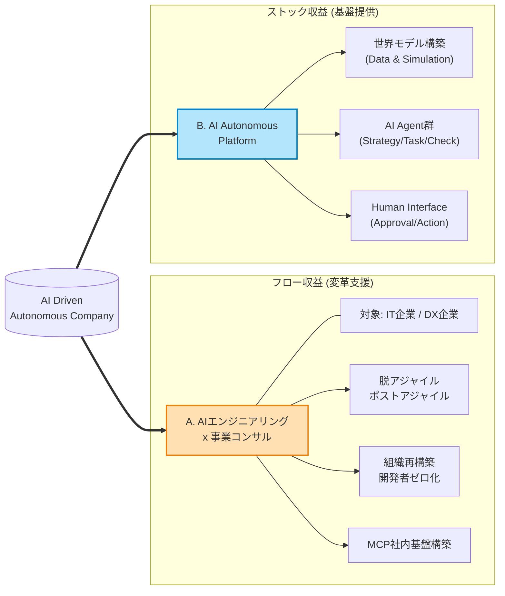

# AI Driven Autonomous Company

## 事業計画詳細
### AI駆動自律型企業への変革

---

# 1. エグゼクティブサマリ

- **パラダイムシフト**:
  - 「人間中心の効率化」から**「AI主体の自律化」**へ
- **AI Driven Autonomous Company**:
  - AI Agentが意思決定・実行の主体
  - 人間は「ミッション定義」「承認」「物理実行」に特化
- **ビジネスモデル**:
  - 自社での実証（ドッグフーディング）
  - コンサルティング & プラットフォーム提供

---

# 2. 事業ミッション & ビジョン

## ミッション
**AI駆動企業「AI Driven Autonomous Company」を、社会の標準インフラとする**

## ビジョン
**AIの進化を見越して、社会・人類の未来を創る**

## コアバリュー
- **Zero-Base Design**: AIネイティブなゼロベース設計
- **Autopilot**: 人間の介在を「例外処理」として最小化
- **Believe the Scaling**: 指数関数的成長（Scaling Law）を前提

---

# 3. AI Driven Autonomous Company とは？

- **概要**:
  - 従来の「人間中心業務」をAIが完全代替
  - 人間がその自律を支援する形態
- **役割分担**:
  - **AI**: 意思決定、タスク実行
  - **人間**: ミッション定義、スキーム定義、承認、物理実行、監査
- **特徴**:
  - **自律性**: 業務の大部分を自動化
  - **役割再定義**: 人間は創造・責任・現場対応へ
  - **透明性**: 全意思決定プロセスの記録・監査

---

# 4. マーケット分析とターゲット

## 市場環境
- **ポジショニング**: AIネイティブ企業の定義・プラットフォーマー化
- **AIの進化**: 「AI主体」企業と「ツール利用」企業の格差拡大
- **労働市場**: ホワイトワーカー代替 → 責任・身体性へのシフト

## ターゲット
1. **Phase 1 (導入期)**: IT・ソフトウェア業界
   - エンジニア不足への「AI代替」解
2. **Phase 2 (展開期)**: サービス・オペレーション産業
   - コールセンター、店舗管理等のAIマネージャー化

---

# 5. 提供サービス概要

# 5. 提供サービス概要 (1/2)

## A. フロー収益 (変革支援)
**AIエンジニアリング x 事業コンサル**
- 脱アジャイル、ポストアジャイル
- 組織再構築、開発者ゼロ化
- MCP社内基盤構築

## B. ストック収益 (基盤提供)
**AI Autonomous Platform**
- 世界モデル構築 (Data & Sim)
- AI Agent群 (Strategy/Task/Check)
- Human Interface (Approval/Action)

---

# 5. 提供サービス概要 (2/2) 構造図

---

# 6. 差別化要因 (Competitive Advantages)

1. **"Copilot" ではなく "Autopilot"**
   - 主従逆転：AIが主、人間が副
   - 人間の制約を超えたスケーラビリティ
2. **"DX" ではなく "AX" (AI Transformation)**
   - 既存改善ではなく、AI最適へのゼロベース再構築
3. **"Agile" ではなく "Autonomous"**
   - Swarmによる調整コストゼロ化
   - 人間は「承認ゲート」のみ
4. **自社が最大の「実験体」**
   - 開発者・管理者ゼロでの極端なドッグフーディング

---

# 7. 展開戦略（ロードマップ）

- **Year 1: 実証実験 (Phase 1)**
  - 自社バックオフィス・開発の90% AI化
  - コアエンジン開発、MCP統合
- **Year 2: コンサル展開 (Phase 2)**
  - IT業界向け「開発組織再構築」
  - パイロット実施、パートナー提携
- **Year 3+: プラットフォーム化 (Phase 3)**
  - サービス業・他業種展開
  - SaaS/RSモデルでの外部販売拡大

---

# 8. 売上シミュレーション

| 年度 | フェーズ | 主な収益源 | 売上目標 |
| :--- | :--- | :--- | :--- |
| **Year 1** | 準備 | 受託・アドバイザリー | 1,000万円 |
| **Year 2** | コンサル | 戦略コンサル・PMO | 2,500万円 |
| **Year 3** | プラットフォーム | ライセンス・RS | 3,750万円 |
| **Year 5** | スケール | 全産業展開 | 8,400万円 |

**KPI**:
- Agent稼働率 (目標95%+)
- 意思決定速度

---

# 9. リスクと対策

- **技術的リスク (ハルシネーション)**
  - Check AIによる二重検証
  - 人間の最終承認 (Human-in-the-loop)
- **受容性リスク (心理的抵抗)**
  - AIを「上司」ではなく「参謀」と位置づけ
  - 人間が決定権を持つUX
- **競合リスク (大手参入)**
  - 「改善」ではなく「再構築」という急進的差別化

---

# 10. 必要なリソース

- **人材**:
  - AIエンジニア (LLM/Agent)
  - 組織設計コンサルタント
  - UI/UXデザイナー
- **インフラ**:
  - LLMコスト、計算リソース
- **資金**:
  - シード/アーリー投資 (COSTA含む)

